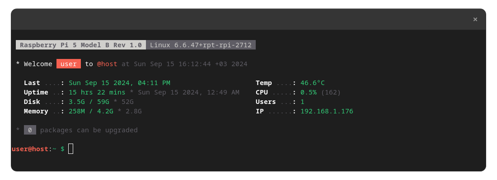

# MOTD Scripts

This repository provides a collection of scripts for customizing the Message of the Day (MOTD) on Unix-based systems. These scripts offer dynamic updates and visually appealing presentations of system information upon SSH connection or system access.

## Overview

The MOTD scripts are designed to enhance the login experience by displaying useful system information in a styled format. This repository includes:

- **`theme`**: Defines color palettes and styling options.
- **`10-welcome`**: Displays a personalized welcome message.
- **`20-sysinfo`**: Shows detailed system information in a two-column layout.
- **`30-update`**: Provides information about upgradable packages.

## Configuration

### Colors

The `theme` script defines the color palette used throughout the MOTD. You can customize the colors by editing the `theme` script. Here is an example of the color palette configuration:

```bash
# Color Palette
accent="91"            # Red
secondary="92"         # Green
title="1"              # Bold
muted="90"             # Gray
```

### Screenshots

#### Example MOTD



#### Package Updates


*Example of the update notification showing the number of upgradable packages.*

## Installation

To set up these scripts on your system, follow these steps:

1. **Clone the Repository**
   ```bash
   git clone https://github.com/oezturk/update-motd-raspberrypi.git
   cd update-motd-raspberrypi
   ```

2. **Copy Scripts to `/etc/update-motd.d/`**
   ```bash
   sudo cp update-motd.d/* /etc/update-motd.d/
   ```

3. **Set Permissions**
   ```bash
   sudo chmod +x /etc/update-motd.d/*
   ```

## Usage

Once installed, the MOTD scripts will automatically update the login message when users access the system. The information displayed will reflect real-time system status and updates.

## Customization

You can modify the scripts to fit your needs:

- **Adjust Colors**:
  - Edit the `theme` script to change color settings.
- **Update Information Displayed**:
  - Modify `10-welcome`, `20-sysinfo`, and `30-update` scripts to include additional information or change formatting.
  - Note: It is recommended to be cautious when editing these files. Ensure you understand the changes being made.

## License

This project is licensed under the MIT License - see the [LICENSE](LICENSE) file for details.

## Contributing

Contributions are welcome! Please open issues or submit pull requests with improvements or suggestions.
