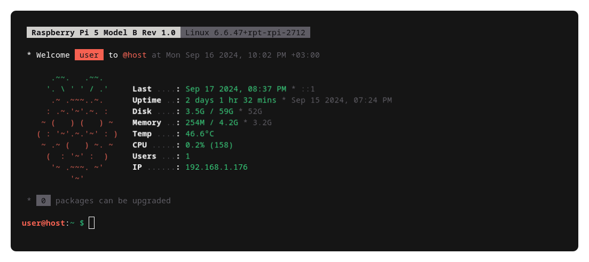
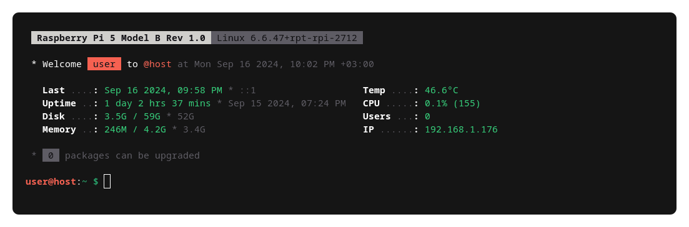

# MOTD Scripts

This repository provides a collection of scripts for customizing the Message of the Day (MOTD) on Unix-based systems. These scripts enhance the login experience by displaying ASCII art and other useful system information upon SSH connection or system access.

## Table of Contents

- [Overview](#overview)
- [Screenshots](#screenshots)
- [Customizing](#customizing)
  - [Themes](#themes)
  - [Customizing Options](#customizing-options)
  - [Custom Theme](#custom-theme)
- [Installation](#installation)
  - [Quick Install (Recommended)](#quick-install-recommended)
  - [Manual Installation](#manual-installation)
- [Usage](#usage)
- [License](#license)
- [Contributing](#contributing)

## Overview

The MOTD scripts include:

- **`default`**: Main file defining custom options and settings.
- **`themes/`**: Directory for color palettes and styles.
- **`10-welcome`**: Displays a personalized welcome message.
- **`20-sysinfo`**: Shows detailed system information in a two-column layout.
- **`30-update`**: Provides information about upgradable packages.

## Screenshots

### Example MOTD


*Example of ASCII art logo in the MOTD.*


*Example of the standard MOTD display.*

#### Package Updates


*Example of the update notification showing the number of upgradable packages.*

## Customizing

### Themes

The `/etc/update-motd.d/themes` folder contains built-in theme files:

- **`themes/raspi`**: Default theme with raspberry colors.
- **`themes/gray`**: Theme with only white shades (black & white).
- **`themes/nostyle`**: Plain text theme without styling.

To create your own theme, follow the Custom Theme section below.

### Customizing Options

Set customizing options in the `/etc/update-motd.d/default` script.

```bash
DEFAULT_THEME="/etc/update-motd.d/themes/raspi" # Theme directory
ASCII_ART="true" # Enable ASCII art logo
HOUR_FORMAT_24="false" # Enable 24-hour format
# and other options...
```

### Custom Theme

To create a custom theme:

1. **Create a New Theme File**

   ```bash
   sudo nano /etc/update-motd.d/themes/my-theme
   ```

2. **Add Your Custom Color Palette and Styles**

   Example theme configuration:

   ```bash
   # Color Palette
   accent="91"            # Red
   second="92"            # Green
   title="1"              # Bold
   muted="90"             # Gray

   # Background versions
   inv_accent="101;30"    # Inverted Red
   inv_second="102;30"    # Inverted Green
   inv_title="1;47;30"    # Inverted Bold
   inv_muted="100;30"     # Inverted Gray

   # Custom symbols
   bullet="*"
   colon=":"
   ```

3. **Set Your Custom Theme as Default**

   Edit the `/etc/update-motd.d/default` file and update the `DEFAULT_THEME` variable to point to your new theme directory.

   ```bash
   sudo nano /etc/update-motd.d/default
   ```

   Change `DEFAULT_THEME` to your custom theme directory.

## Installation

### Quick Install (Recommended)

To quickly set up the MOTD scripts:

1. **Clone the Repository and Run the Installer**

   ```bash
   git clone https://github.com/oezturk/update-motd-raspberrypi.git
   cd update-motd-raspberrypi
   sudo bash install.sh
   ```

### Manual Installation

To manually set up the MOTD scripts:

1. **Clone the Repository**

   ```bash
   git clone https://github.com/oezturk/update-motd-raspberrypi.git
   cd update-motd-raspberrypi
   ```

2. **Remove Older Scripts in `/etc/update-motd.d/`**

   ```bash
   sudo rm -rf /etc/update-motd.d/*
   ```

3. **Copy Scripts to `/etc/update-motd.d/`**

   ```bash
   sudo cp -r update-motd.d/* /etc/update-motd.d/
   ```

4. **Set Permissions**

   ```bash
   sudo chmod +x /etc/update-motd.d/*
   sudo chmod +r /etc/update-motd.d/themes/*
   ```

## Usage

Once installed, the MOTD scripts will automatically update the login message when users access the system. The information displayed will reflect real-time system status and updates. You can take a look at the [Customizing](#customizing) section to personalize the experience. 

## License

This project is licensed under the MIT License - see the [LICENSE](LICENSE) file for details.

## Contributing

Contributions are welcome! Please open issues or submit pull requests with improvements or suggestions.
